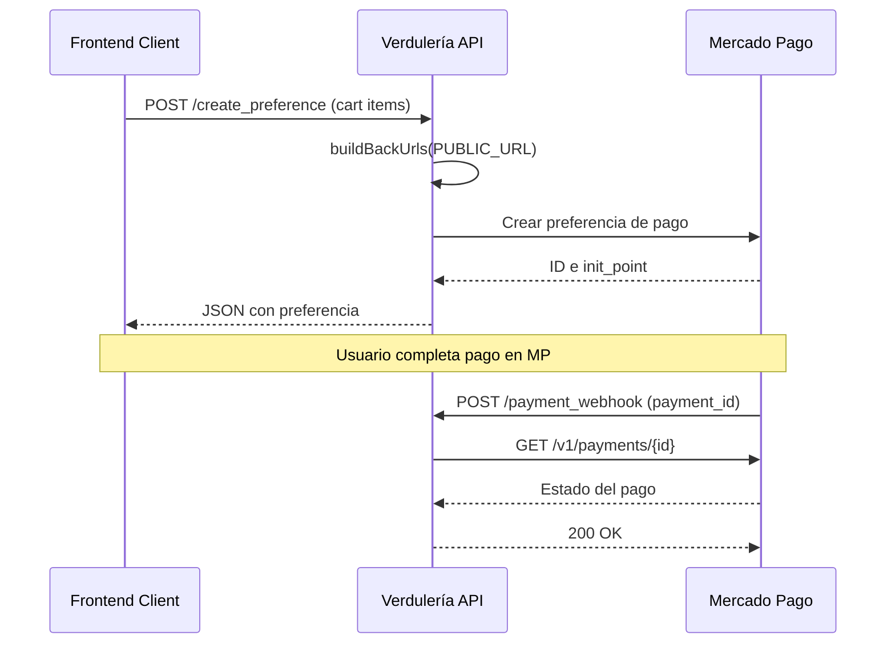

# Verdulería API

Backend service para procesamiento de pagos con Mercado Pago para Verdulería José.

## 🌐 Demo Frontend
https://verduleria-front.vercel.app/

## 📋 Descripción
API REST construida con Express.js que actúa como intermediario entre el frontend y Mercado Pago, gestionando la creación de preferencias de pago y procesando notificaciones asíncronas vía webhooks.

## 🛠️ Tecnologías
- **Node.js** - Runtime environment 
- **Express.js** - Framework web  
- **Mercado Pago SDK** - Integración de pagos 
- **CORS** - Manejo de solicitudes cross-origin 
- **Dotenv** - Gestión de variables de entorno 

## 🚀 Configuración del Entorno

Crea un archivo `.env` basado en `.env.example`:

```env
MP_ACCESS_TOKEN=TEST-xxxxxxxxxxxxxxxxxxxxxxxxxxxxxxxx-xxxxx
PUBLIC_URL=https://verduleria-front.vercel.app
ALLOWED_ORIGINS=https://verduleria-front.vercel.app
PORT=3000
```

**Importante**: Para producción, configura `PUBLIC_URL` con la URL de tu frontend: `https://verduleria-front.vercel.app` 

## 📡 Endpoints de la API

### POST /create_preference
Crea preferencias de pago en Mercado Pago.
- **Body**: `{ items: [], metadata: {} }`
- **Response**: `{ id, init_point }`

El endpoint normaliza los items del carrito y construye las URLs de retorno usando `buildBackUrls()` 

### POST /payment_webhook
Recibe notificaciones de estado de pago desde Mercado Pago.
- **Procesa**: Pagos aprobados, pendientes y rechazados
- **Response**: `{ success: true, message: 'Webhook processed' }`

El webhook obtiene detalles del pago y registra el estado en la consola 

### GET /health
Endpoint de verificación de salud del servidor.
- **Response**: `{ ok: true }` 

## 🏗️ Arquitectura

### Flujo de Integración


### Configuración CORS
La API permite orígenes configurados via `ALLOWED_ORIGINS` con métodos GET, POST, OPTIONS 

## 🚀 Ejecución Local

1. Clonar el repositorio
2. Instalar dependencias: `npm install`
3. Configurar archivo `.env`
4. Iniciar servidor: `npm run dev` o `npm start` 

El servidor iniciará en el puerto configurado y mostrará la URL del webhook 

## 📁 Estructura del Proyecto

```
verduleria-api/
├── index.js           # Servidor Express y lógica principal
├── package.json       # Dependencias y scripts
├── .env.example       # Plantilla de variables de entorno
├── .gitignore         # Archivos ignorados por Git
└── .gitattributes     # Configuración de Git (LF normalization)
```

## 🔧 Variables de Entorno

| Variable | Descripción | Requerida |
|----------|-------------|-----------|
| `MP_ACCESS_TOKEN` | Token de acceso a Mercado Pago API | ✅ |
| `PUBLIC_URL` | URL base para webhooks y redirecciones | ✅ |
| `ALLOWED_ORIGINS` | Orígenes permitidos para CORS (separados por coma) | ❌ |
| `PORT` | Puerto del servidor (default: 3000) | ❌ |

## Notes

La API utiliza ES modules (`"type": "module"` en package.json) y sigue una arquitectura modular con middleware para CORS y parsing de JSON. El servidor incluye middleware especial para capturar el body raw de webhooks.

Wiki pages you might want to explore:
- [Overview (Nickfer1989/verduleria-api)](/wiki/Nickfer1989/verduleria-api#1)
- [Configuration & Environment (Nickfer1989/verduleria-api)](/wiki/Nickfer1989/verduleria-api#5)

